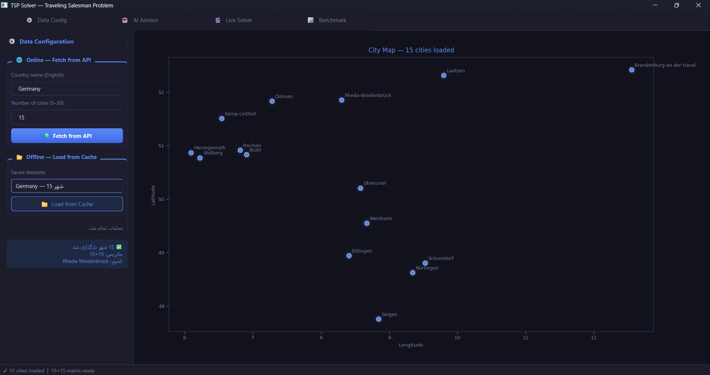
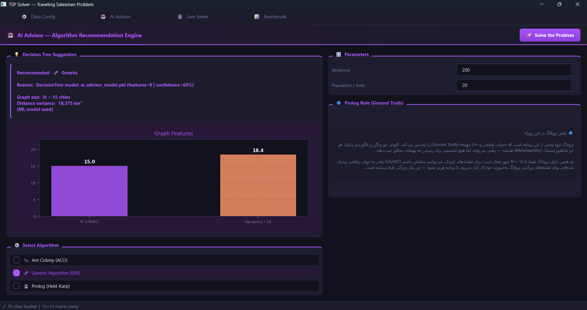
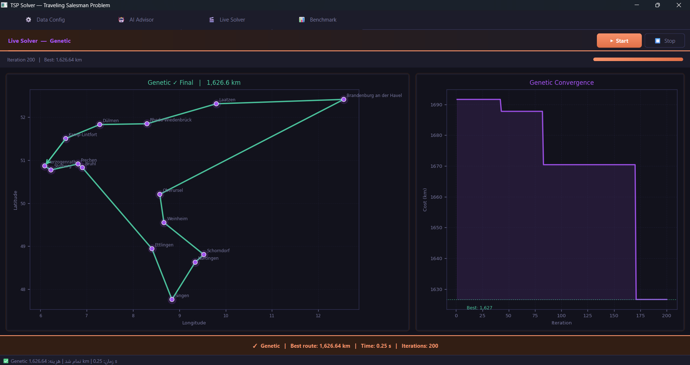
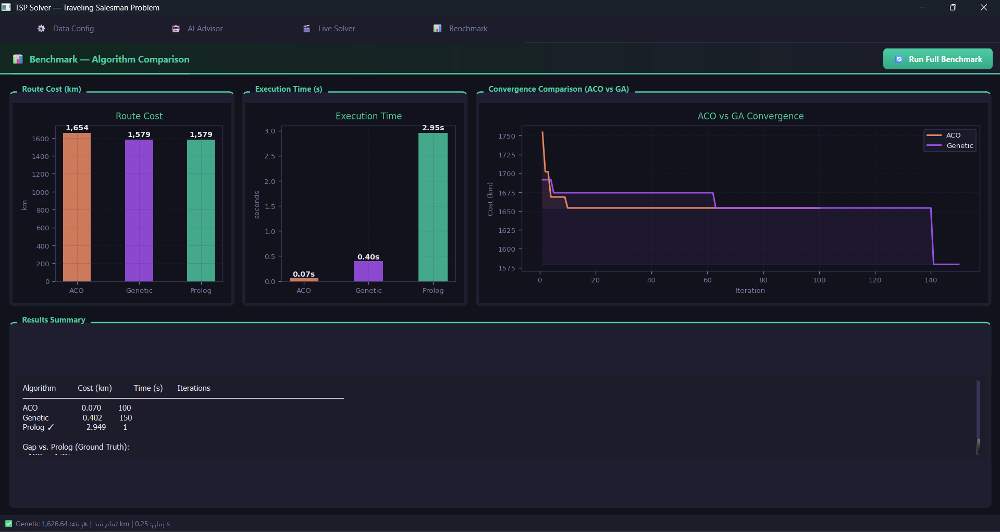

# 🧠 Intelligent TSP Solver

## Hybrid AI Framework for the Traveling Salesman Problem

```{=html}
<p align="center">
```


```{=html}
</p>
```

------------------------------------------------------------------------

## 📌 Overview

This project implements an intelligent framework for solving the
**Traveling Salesman Problem (TSP)** by combining classical Artificial
Intelligence techniques, optimization algorithms, logic programming, and
machine learning.

The system provides multiple independent solving strategies and an
intelligent advisor that recommends a suitable algorithm based on the
characteristics of the input graph.

The implemented approaches include:

-   Exact dynamic programming with **Prolog / Held-Karp**
-   Swarm intelligence using **Ant Colony Optimization (ACO)**
-   Evolutionary computation using **Genetic Algorithm (GA + ERX)**
-   Machine learning based algorithm recommendation using **Decision
    Tree**

------------------------------------------------------------------------

# ✨ Key Features

-   Multi-strategy TSP solving framework
-   Exact vs heuristic algorithm comparison
-   Geographic city modeling
-   Automatic distance matrix generation
-   PyQt6 graphical user interface
-   Real-time route visualization
-   ML-based solver recommendation
-   Modular and extensible architecture

------------------------------------------------------------------------

# 🏗️ Architecture

                         PyQt6 GUI
                             |
                             v

                  Geographic Data Layer
                  (GeoNames API + Cache)

                             |
                             v

                  Distance Matrix Generator
                  (Haversine Formula)

                             |
            +----------------+----------------+
            |                |                |
            v                v                v

          ACO Solver       GA Solver     Prolog Solver
       Swarm Intelligence Evolutionary   Exact DP
                             |
                             v

                  Decision Tree Advisor
                  Algorithm Selection

------------------------------------------------------------------------

# 🧩 Implemented Algorithms

## 🐜 Ant Colony Optimization (ACO)

ACO is a swarm intelligence algorithm inspired by the collective
behavior of ants.

The implementation uses:

-   Artificial pheromone trails
-   Probabilistic city selection
-   Pheromone evaporation
-   Best-route reinforcement

It is designed for solving larger TSP instances where exact algorithms
become expensive.

------------------------------------------------------------------------

## 🧬 Genetic Algorithm (GA + ERX)

A population-based evolutionary optimization method.

Main components:

-   Initial population generation
-   Fitness evaluation
-   Selection
-   Mutation
-   Edge Recombination Crossover (ERX)

The ERX operator helps preserve high-quality connections between cities
during crossover.

------------------------------------------------------------------------

## 🔮 Prolog Exact Solver (Held-Karp)

A logic programming based exact solver implemented in **SWI-Prolog**.

This module demonstrates the use of declarative programming for
optimization problems.

Features:

-   Held-Karp dynamic programming approach
-   Optimal solution guarantee
-   Memoization optimization
-   Bitmask based state representation

The Prolog solver acts as a ground truth baseline for evaluating
heuristic algorithms.

------------------------------------------------------------------------

## 🌳 Intelligent Algorithm Advisor

A Decision Tree classifier is used as a meta-level AI component.

The advisor analyzes graph features such as:

-   Number of cities
-   Distance distribution
-   Graph characteristics

and predicts the most suitable solver:

-   Exact solver
-   ACO
-   Genetic Algorithm

------------------------------------------------------------------------

# 🌍 Data Processing

The project uses geographic city information obtained through the
GeoNames API.

Data processing pipeline:

1.  Retrieve city coordinates
2.  Convert locations into graph nodes
3.  Calculate pairwise distances using the Haversine formula
4.  Generate an N×N weighted distance matrix
5.  Provide the matrix to all solvers

------------------------------------------------------------------------

# 📂 Project Structure

    intelligent-tsp-solver/

    ├── src/
    │   ├── main.py
    │   ├── gui.py
    │   ├── core.py
    │   ├── solvers.py
    │   └── prolog_bridge.py
    │
    ├── prolog/
    │   └── tsp_solver.pl
    │
    ├── scripts/
    │   └── train_model.py
    │
    ├── models/
    │   └── trained advisor model
    │
    ├── _REPORT_/
    │   ├── pic1.png
    │   ├── pic2.png
    │   ├── pic3.png
    │   └── pic4.png
    │
    ├── README.md
    └── requirements.txt

------------------------------------------------------------------------

# 🖥️ Screenshots

## Application Interface





## Algorithm Execution and Results





------------------------------------------------------------------------

# ⚙️ Installation

Clone the repository:

``` bash
git clone https://github.com/moeinHP-aussie/intelligent-tsp-solver.git

cd intelligent-tsp-solver
```

Install dependencies:

``` bash
pip install -r requirements.txt
```

------------------------------------------------------------------------

# ▶️ Running

Run the application:

``` bash
python src/main.py
```

Train the ML advisor:

``` bash
python scripts/train_model.py
```

------------------------------------------------------------------------

# 📊 Algorithm Comparison

  Method              Category             Optimal Solution   Best Use Case
  ------------------- -------------------- ------------------ --------------------------
  Held-Karp           Exact DP             Yes                Small graphs
  ACO                 Swarm Intelligence   Approximate        Large search spaces
  Genetic Algorithm   Evolutionary         Approximate        Large instances
  Decision Tree       ML Advisor           Selection          Algorithm recommendation

------------------------------------------------------------------------

# 🔬 Technologies

-   Python
-   PyQt6
-   NumPy
-   Scikit-learn
-   SWI-Prolog
-   GeoNames API

------------------------------------------------------------------------

# 👨‍💻 Author

**Moein Hassanpour**

Artificial Intelligence Course Project

------------------------------------------------------------------------

# ⭐ Academic Purpose

This project demonstrates how different AI paradigms can cooperate to
solve a classical NP-hard optimization problem.

It combines:

-   Search and optimization
-   Logic programming
-   Evolutionary algorithms
-   Machine learning
-   Software architecture design
